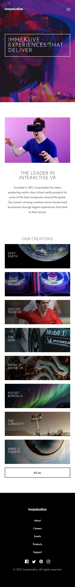

# Frontend Mentor - Loopstudios landing page solution

This is a solution to the [Loopstudios landing page challenge on Frontend Mentor](https://www.frontendmentor.io/challenges/loopstudios-landing-page-N88J5Onjw) by **Afolabi A. John (Gentry)**. Frontend Mentor challenges help you improve your coding skills by building realistic projects. 

## Table of contents

- [Overview](#overview)
  - [The challenge](#the-challenge)
  - [Screenshot](#screenshot)
  - [Links](#links)
- [My process](#my-process)
  - [Built with](#built-with)
  - [What I learned](#what-i-learned)
- [Author](#author)

## Overview

### The challenge

Users should be able to:

- View the optimal layout for the site depending on their device's screen size
- See hover states for all interactive elements on the page

### Screenshot

Desktop View

Mobile View

### Links

- Solution URL: [GitHub Repo](https://github.com/GentryHQ/loopstudios-landing-page)
- Live Site URL: [GitHub Page](https://gentryhq.github.io/loopstudios-landing-page)

## My process

### Built with

- Semantic HTML5 markup
- CSS custom properties
- Flexbox
- CSS Grid
- Mobile-first workflow
- SCSS

### What I learned

- I was able to disable scroll on mobile menu toggle
- I also learnt how to create better and more responsive designs
- Worked with Animate on Scroll Library to do so animations.
- I'd an extensive use of CSS Grid... And it taught be more on how to layout a website using CSS Grid.

## Author

- Website - [Gentry.com.ng](https://www.gentry.com.ng)
- Frontend Mentor - [@GentryHQ](https://www.frontendmentor.io/profile/GentryHQ)
- Twitter - [@iam_gentry](https://www.twitter.com/iam_gentry)

